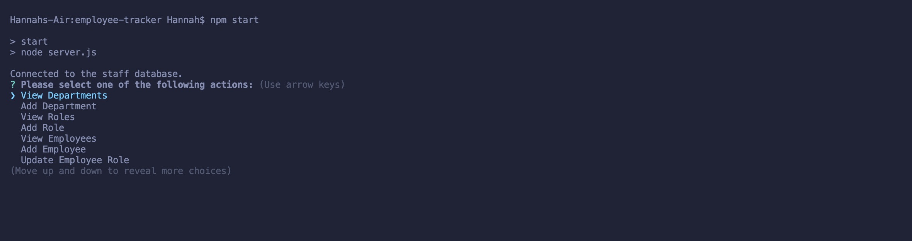
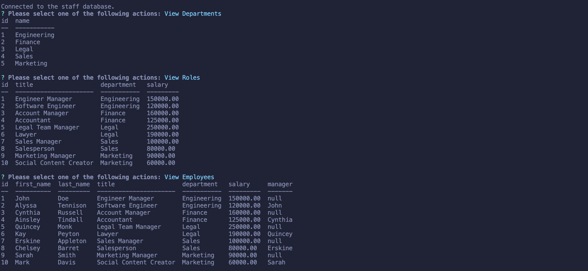

# Employee Tracker: employee-tracker

Module 12 - SQL Challenge: Employee Tracker

---

## Description

This is a solely a command line application with the purpose of creating a content management system to allow users to interact with information stored in databases. Employee Tracker is meant for business owners to be view and manager their staff to help with business planning and organization.

There are future development plans for employee-tracker to add the following features:

- View employees by manager name
- View employees by department name
- Delete departments, roles, and employees
- View the total utilized budget of a department

### Skills Learned/ Improved

Here is a list of some skills I learned and/or improved throughout this project:

- Using inquirer to prompt users with questions and gather user inputs.
- Organizing files into various directories based on file purpose/use.
- JavaScript for backend development.
- Using MySQL to create/ navigate a database.
- Primary and foreign keys.
- Joining tables to display desired information.

Tools used to complete this project:

- VS Code
- Terminal
- GitHub
- Node.js
- Inquirer
- MySQL

## Installation

To install the application:

1. Open the GitHub repository.
2. Click the blue code dropdown button, select the preferred cloning method, and clone code to device.
3. Open the cloned code in preferred code editor.
4. Run 'npm start' to initialize the application.

## Usage

Employee Tracker is intended for business owners who would like to have an organizational method to manage their employees and business. The application starts by asking the user to select which action they would like and then perform or display said action.

Currently, Employee Tracker has the following actions:

- View departments
- View roles
- View employees
- Add department
- Add role
- Add employee
- Update employee role (and manager if applicable)

Here is the application after initializing when asking user to choose an action:

Here is an example of the data that can be accessed:

### Links

Since this is a command line application, there is no deployed link.

[Link](https://github.com/alverson98/employee-tracker) to code repository.

## Questions

You may contact me with any questions or concerns through the email provided or my GitHub.

Email: alverson98@yahoo.com

GitHub: https://github.com/alverson98

## Credits

I received guidance and tips from the instructional staff, TA's, and Students from the University of Denver Coding Boot Camp.
